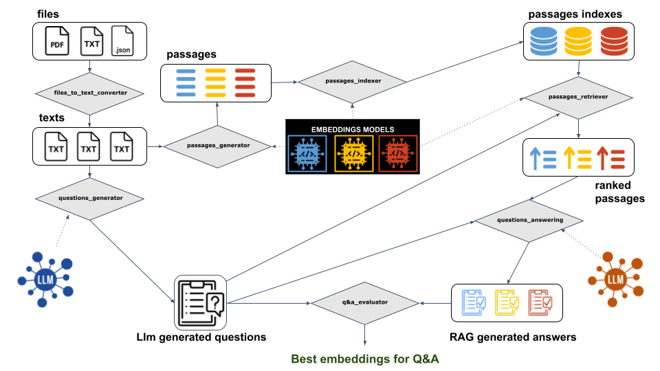

# BES4RAG: Best Embedding Selection for Retrieval-Augmented Generation



## Overview
This framework selects the optimal embedding model to be paired with a large language model (LLM) in a Retrieval-Augmented Generation (RAG) system. The system is designed to answer questions based on a given knowledge source, which can be in the form of PDFs, text files, or transcripts from audio and video sources.

A key component of this approach is an automated multiple-choice question generation module, supported by an questioning LLM. Once the questions are generated, documents are segmented into chunks, embeddings are precomputed, and the most relevant segments are retrieved to assist the answering LLM in answering the questions. The system evaluates both the accuracy of the responses and the quality of the retrieved document segments, enabling the selection of the best embedding model for a given dataset.

## Installation
To install **BES4RAG**, run the following command:

```bash
python setup.py install
```

## Usage

Once installed, the entire pipeline can be launched using:
```bash
python launch.py <dataset_path>
```
where <dataset_path> is the path to the dataset containing the knowledge source.


